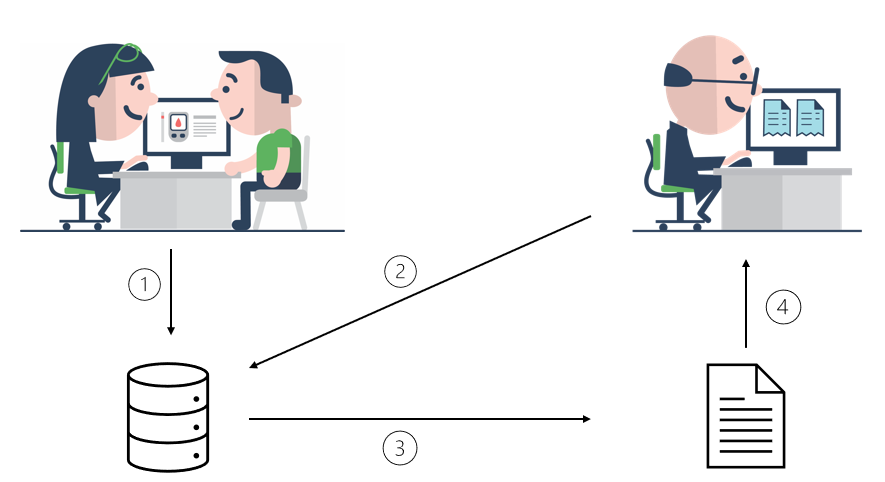

<!-- HomePage -->
# MedCom Shared Condition Overview 
<!-- below is the table of content. Ensure to update it. -->
**Table of Content**
* [1 Standard Documentation](#standard)
  * [1.1 User stories](#11-user-stories)
  * [1.2 Use Cases](#12-use-cases)
  * [1.3 Technical specification](#13-technical-specification)
  * [1.4 Mapping from logical data model to ConditionList](#14-mapping-from-logical-data-model-to-conditionlist)
* [2 Test and Certification](#2-test-and-certification)
  
 

This page presents the project Shared Condition Overview (Danish: Deling af diagnoseoversigt), to which MedCom has developed the FHIR standard called ConditionList. The purpose of the project is to centralize selected patient/citizen diagnoses from general practice and other healthcare providers in a standardized way using document sharing. The general practitioner and the patient will review the patient’s diagnoses during a consultation, identifying and marking only relevant conditions to be shared in a ConditionList. 
Only selected diagnoses are shared in order to ensure clarity in the patient’s records. The term "diagnoses" do not exclusively refer to diseases in the context of the ConditionList, but also includes relevant current diseases, prior diseases, significant events, and conditions. It is the responsibility of the general practitioner to establish the ConditionList in consultation with the patient and subsequently update it as new information is received, including discharge summaries (Danish: Epikriser) and new diagnoses. This practice is already widely adopted among general practitioners who regularly utilize the list (Danish: Diagnosekortet) for coordinated care across the healthcare system.
The list is available for both patients, relatives with power of attorney and healthcare providers.

The ConditionList standard is implemented as a FHIR Document and shared over the National Service Platform (NSP) in Denmark. A simple illustration of the flow of data is depicted in <a href="#Fig1">Figure 1</a>. A short description of the flow follows: 1) The general practitioner and the patient will at a consultation go through the patient's diagnoses and share a selected list from them. The diagnoses are then stored in a database with relevant information. 2) Another healthcare professional with the right authorization then requests the ConditionList. 3) A document is generated with the available information. 4) The healthcare professional can now see the patient's diagnoses. 

<figure>

<figcaption text-align = "center"><b>Figure 1 illustrates the flow of data when a ConditionList is created and requested.</b></figcaption>
</figure>
 
## 1 Standard Documentation {#standard}
The project Shared Condition Overview is owned by the Danish Health Data Agency (Danish: Sundhedsdatastyrelsen (SDS)) and is a part of the program "Et samlet patientoverblik". In this collaboration, both SDS and MedCom have provided content for the standard and its usage. 

On the project page for <a href="https://www.nspop.dk/display/ESP/Indhold+og+forretningsregler+diagnoser" target="_blank">Shared Condition Overview on NSPOP</a>, the following documentation can be found: 
  * Overall purpose of the standard
  * Logical information and data models
  * Business rules
  * Technical guide for implementation of the ConditionList standard.

On this page, provided by MedCom, additional information on how to implement the standard ConditionList:
  * User stories
  * Use cases
  * Technical Specifications in terms of the relevant Implementation Guide (IG).
  * Mapping from logical data model to ConditionList
  * Test and certification

&nbsp;

### 1.1 User stories
A user story is an informal, general description of a systems functionality as perceived from the user's perspective. User stories have the end user at the centre of the dialogue about system functionality. User stories describe which needs the end user wants fulfilled, so that the developer understands the context of the development task: why they are developing the function and what value it must provide the end user. Not all user stories will be supported with this current implementation, which is noted for the specific user story.

[User stories (pdf)](assets/documents/UserStories_SharedConditionOverview.pdf)   

### 1.2 Use Cases

Use cases describe the different scenarios a standard support. For a certain real-world scenario, it describes the requirements for the content of a message. The purpose of the use cases is to ensure a coherent implementation and use of the ConditionList standard. The descriptions are targeted IT-system vendors and the people responsible for the implementation in regions and municipalities.

[Use cases (pdf)](assets/documents/UseCases_SharedConditionOverview1.pdf)  

### 1.3 Technical specification

The technical specification for the ConditionList standard is composed by profiles from two IGs.
* <a href="http://medcomfhir.dk/ig/document" target="_blank">MedCom Document</a>, which provides the overall document structure and base requirements
* <a href="http://medcomfhir.dk/ig/conditionlist" target="_blank">MedCom Condition List</a>, which provides the requirements specific for the use of the ConditionList standard.

### 1.4 Mapping from logical data model to ConditionList
The page is intended to help translate the <a href="https://www.nspop.dk/display/ESP/Indhold+og+forretningsregler+diagnoser" target="_blank">logical data model</a> to the <a href="http://medcomfhir.dk/ig/conditionlist" target="_blank">FHIR ConditionList standard</a>. More information about the mapping can be found on the following page.

[Danish: Mapping](assets/documents/Mapping-DA.md)

## 2 Test and Certification
Certification of a system implies both an approved test protocol and run-through of TouchStone test scripts for providing systems and approved test protocol for receiving systems. TouchStone describes an infrastructure that allows for automated test and validation against the IG's developed by MedCom. 

<a href="https://medcomdk.github.io/MedComLandingPage/#3-test-and-certification">Click here to find the description of test and certification of FHIR standards in MedCom.</a> 

**Providing a ConditionList document**
  * [Test protocol for sending a ConditionList](assets/documents/ConditionList_Testprotocol_Send.docx)
  * [List of diagnoses for test protocol](assets/ConditionList_Diagnoses_Send.docx)
  * [TouchStone test script suite for sending a ConditionList](https://touchstone.aegis.net/touchstone/conformance/current?suite=FHIR4-0-1-ConditionList-send-Client)
    * [MedCom guide: TouchStone getting started](https://medcomdk.github.io/MedComLandingPage/assets/documents/TouchStoneGettingStarted.html)

    

&nbsp;

 
**Receiving a ConditionList document**
  * [Test protocol for receiving a ConditionList](assets/documents/ConditionList_Testprotocol_Receive.docx)
  * [Test examples for receive test protocol](assets/TestExamples.zip)

&nbsp;

